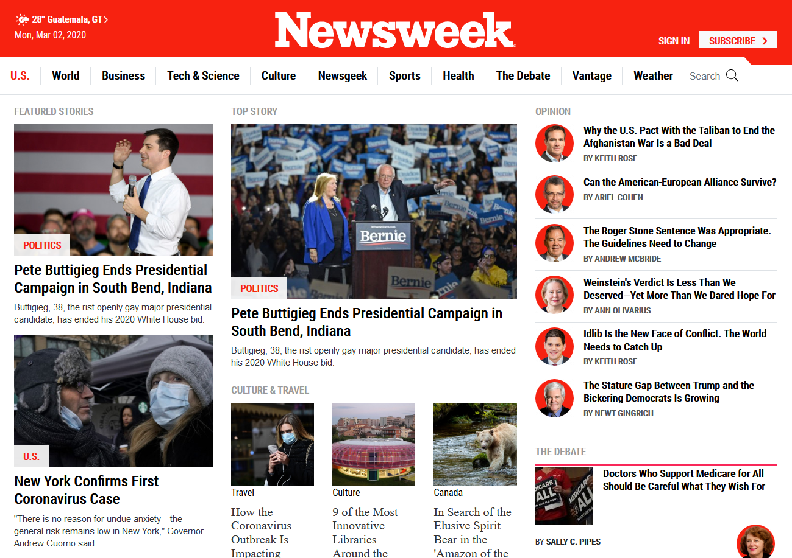

# Cloning Newsweek Web Page Using Bootsrap

> This web page is the seventh project in the Microverse course and its objective is to practice the use of a framework for CSS as is Bootstrap.

The URL of the Newsweek site is [here](https://www.newsweek.com/), according to the date, the style of the web page may vary.

## Built With

- HTML,
- Bootstrap,
- CSS

## Live Demo

[Live Demo Link](https://rawcdn.githack.com/meme-es/usingbootstrap/develop/)

## Authors

👤 **Manuel**

- Github: [@meme-es](https://github.com/meme-es)
- Twitter: [@meme_es](https://twitter.com/meme_es)
- Linkedin: [linkedin](https://www.linkedin.com/in/manuel-elias-b289a638/)

## 🤝 Contributing

Contributions, issues and feature requests are welcome!

Feel free to check the [issues page](https://github.com/meme-es/usingbootstrap/issues).

## Show your support

Give a ⭐️ if you like this project!

## 📝 License

This project is free licensed.